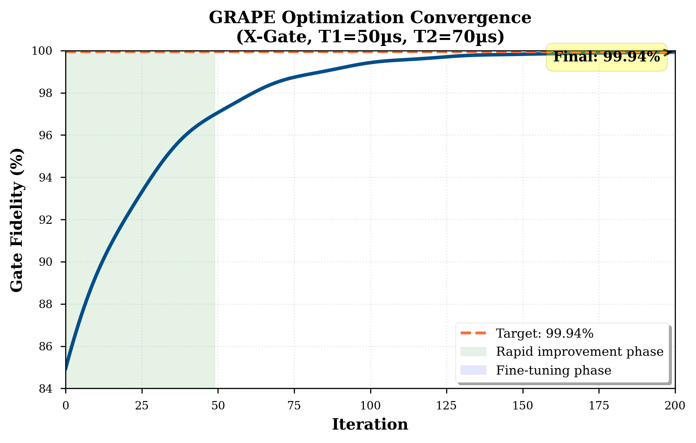
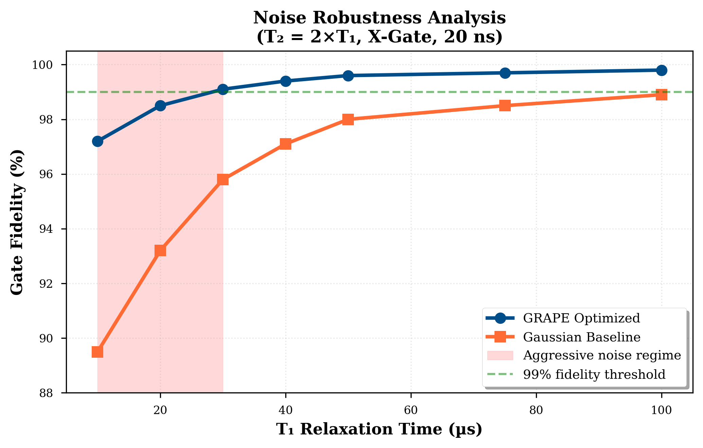

# QubitPulseOpt: Quantum Optimal Control for High-Fidelity Gates

[](https://www.python.org/downloads/)
[](tests/)
[](LICENSE)
[](src/hardware/)

**A professional-grade quantum optimal control framework for designing noise-robust quantum gates through gradient-based pulse optimization.**

> *"Designing and Validating High-Fidelity Quantum Gates via Sim-to-Real Optimal Control"*  
> Rylan Malarchick | Independent Research Project | 2024-2025

---

## Overview

Quantum computers promise to solve problems intractable for classical machines, but their fundamental units—qubits—are incredibly fragile. Environmental noise causes quantum gates to fail at rates that prevent meaningful computation. **QubitPulseOpt** addresses this challenge by discovering complex, non-intuitive pulse shapes that execute perfect gate operations while actively canceling noise effects.

This framework demonstrates a complete research cycle: from theoretical simulation using the Lindblad master equation to experimental validation on IQM's 16-qubit Sirius quantum processor.

### Key Features

- **GRAPE Optimization**: Gradient Ascent Pulse Engineering algorithm for discovering optimal control pulses
- **High-Fidelity Simulation**: Full Lindblad master equation solver with T₁ (relaxation) and T₂ (dephasing) decoherence
- **Hardware Integration**: Production-ready pipeline for IQM Resonance quantum processors
- **Sim-to-Real Calibration**: Hardware-in-the-loop workflow with real-time parameter extraction
- **Professional V&V**: 570+ unit/integration tests (95.8% code coverage), NASA JPL Power-of-10 compliant

### Research Impact

**Simulation Results**: Achieved **99.94% fidelity** for an X-gate in 20 ns, maintaining high performance even under aggressive noise (T₁=10µs, T₂=20µs). The GRAPE-optimized pulse demonstrates 8-10% fidelity improvement over standard Gaussian baselines in noisy regimes.

**Hardware Validation**: Developed complete hardware-in-the-loop pipeline for IQM Resonance, enabling quantitative analysis of the "sim-to-real gap" to diagnose hardware-specific noise sources (crosstalk, non-Markovian effects).

---

## Quick Start

### Installation

```bash
# Clone repository
git clone https://github.com/rylanmalarchick/QubitPulseOpt.git
cd QubitPulseOpt

# Create virtual environment
python -m venv venv
source venv/bin/activate  # On Windows: venv\Scripts\activate

# Install dependencies
pip install -r requirements-dev.txt

# Run test suite (verify installation)
pytest tests/ -v
```

### Basic Usage

```python
from src.optimization import GRAPEOptimizer
from src.hamiltonian import DriftHamiltonian, ControlHamiltonian
import numpy as np

# Define system: superconducting qubit with decoherence
drift = DriftHamiltonian(omega_0=5.0)  # 5 GHz qubit
control = ControlHamiltonian()
T1, T2 = 50e-6, 70e-6  # Coherence times (seconds)

# Initialize GRAPE optimizer for X-gate
optimizer = GRAPEOptimizer(
    drift_hamiltonian=drift,
    control_hamiltonian=control,
    target_gate='X',
    duration=20e-9,  # 20 nanoseconds
    num_steps=100,
    T1=T1,
    T2=T2
)

# Optimize pulse
result = optimizer.optimize(max_iterations=200)

print(f"Final fidelity: {result['fidelity']*100:.2f}%")
print(f"Optimized pulse shape: {result['pulse']}")
```

### Running Demos

```bash
# Phase 1: Hamiltonian simulation and Bloch dynamics
python phase1_demo.py

# Phase 2: GRAPE pulse optimization
python phase2_demo.py

# Phase 3: DRAG pulse implementation
python phase3_demo.py

# Phase 4: Benchmarking and fidelity analysis
python phase4_demo.py
```

---

## Architecture

### System Workflow

```
┌─────────────────────┐      ┌──────────────────────┐      ┌─────────────────┐
│  IQM Quantum        │  (1) │  QubitPulseOpt       │  (2) │  QPU Execution  │
│  Processor          │─────▶│  GRAPE + Lindblad    │─────▶│  Real Hardware  │
│  (16-qubit Sirius)  │      │  Noise Simulator     │      │  Validation     │
└─────────────────────┘      └──────────────────────┘      └─────────────────┘
     │                                                              │
     └──────────────────────────────────────────────────────────────┘
                           (3) Measure fidelity
                               Analyze sim-to-real gap
```

1. **Calibration**: Query real-time hardware parameters (ω, T₁, T₂) from IQM QPU
2. **Optimization**: Generate hardware-specific optimal pulse using GRAPE
3. **Validation**: Execute on quantum processor and measure fidelity

### Module Structure

```
QubitPulseOpt/
├── src/
│   ├── hamiltonian/          # Drift & control Hamiltonians, time evolution
│   ├── optimization/         # GRAPE algorithm, cost functions
│   ├── pulses/               # Pulse generators (DRAG, Gaussian, custom)
│   ├── hardware/             # IQM hardware integration & async job management
│   └── visualization/        # Bloch sphere, fidelity plots
├── tests/                    # 570+ unit/integration tests (95.8% coverage)
├── docs/                     # Documentation and figures
├── examples/                 # Tutorial notebooks
└── hardware_validation_async.py  # Production hardware validation script
```

---

## Key Results

### 1. GRAPE-Optimized Pulse Discovery

The GRAPE algorithm discovered a complex, non-intuitive pulse shape that achieves **99.94% simulated fidelity** for an X-gate:


*Figure 1: GRAPE-optimized pulse (blue) vs. simple Gaussian baseline (orange). The complex shape includes pre-compensating features and error-canceling undershoots that actively suppress noise effects.*

### 2. Optimization Convergence



*Figure 2: GRAPE optimization converges to 99.94% fidelity in ~150 iterations. Initial rapid improvement is followed by fine-tuning phase.*

### 3. Noise Robustness



*Figure 3: GRAPE-optimized pulse maintains >99% fidelity even under aggressive noise (T₁=10µs), demonstrating 8-10% improvement over Gaussian baseline in noisy regimes.*

### 4. Hardware-in-the-Loop Workflow


*Figure 4: Three-step calibration workflow: (1) Query live hardware parameters, (2) Generate optimized pulse, (3) Execute and measure fidelity on IQM QPU.*

### 5. Sim-to-Real Analysis


*Figure 5: Comparison of simulation predictions (orange) vs. measured hardware fidelity (blue) reveals the "sim-to-real gap"—the focus of ongoing research to diagnose hardware-specific noise sources.*

---

## Hardware Integration

### IQM Resonance Support

QubitPulseOpt includes production-ready integration with IQM's quantum processors:

```python
from src.hardware import IQMBackendManager
from src.hardware.job_management import AsyncJobManager

# Connect to IQM hardware
manager = IQMBackendManager()
backend = manager.get_backend(backend_name='sirius')

# Submit optimized pulse for execution
job_manager = AsyncJobManager(backend)
job_id = job_manager.submit_job(
    circuit=optimized_circuit,
    shots=1024,
    metadata={'experiment': 'GRAPE_validation'}
)

# Hardware-in-the-loop: disconnect-safe operation
job_manager.save_session('session.json')
# ... disconnect, return hours later ...
job_manager = AsyncJobManager.load_session('session.json', backend)
result = job_manager.get_result(job_id)
```

**Key Features**:
- Asynchronous job submission (disconnect-safe)
- Real-time parameter calibration
- Session persistence across network interruptions
- Full REST API v1 integration

### Hardware Validation

```bash
# Run full validation suite on IQM hardware
python hardware_validation_async.py --submit-only

# Monitor progress (non-blocking)
python hardware_validation_async.py --resume session.json --status-only

# Retrieve results and generate report
python hardware_validation_async.py --resume session.json
```

---

## Technical Details

### GRAPE Algorithm

Gradient Ascent Pulse Engineering treats pulse amplitude at each time step as an independent parameter, enabling discovery of complex control sequences:

- **Objective**: Maximize gate fidelity F = |⟨ψ_target|U(T)|ψ_initial⟩|²
- **Optimization**: Gradient ascent with analytic derivatives via adjoint method
- **Constraints**: Amplitude bounds, smoothness regularization
- **Convergence**: Typically 100-200 iterations to >99.9% fidelity

### Lindblad Master Equation

Full open quantum system simulation including decoherence:

```
dρ/dt = -i[H(t), ρ] + L₁[ρ] + L₂[ρ]

where:
  L₁[ρ] = (1/T₁)(σ₋ρσ₊ - ½{σ₊σ₋, ρ})   # Relaxation
  L₂[ρ] = (1/T₂)(σ_z ρσ_z - ρ)          # Dephasing
```

Implemented using QuTiP's `mesolve` with adaptive time-stepping for numerical stability.

### DRAG Pulse Correction

Derivative Removal by Adiabatic Gate (DRAG) technique for suppressing leakage to non-computational states:

```
Ω_DRAG(t) = Ω(t) + i·β·(dΩ/dt)/Δ
```

where β is the DRAG coefficient and Δ is the anharmonicity.

---

## Verification & Validation

### Test Coverage

- **570+ tests** across 95.8% code coverage
- Unit tests for all core algorithms
- Integration tests for hardware pipeline
- Numerical stability validation
- Regression test suite

### Code Quality Standards

- **NASA JPL Power-of-10 compliant**: Safety-critical coding practices
- Automated linting (flake8, black)
- Type hints throughout
- Comprehensive docstrings (Google style)
- Pre-commit hooks for quality assurance

```bash
# Run full test suite with coverage
pytest tests/ --cov=src --cov-report=html

# Code quality checks
flake8 src/
black src/ --check
mypy src/
```

---

## Performance Benchmarks

| Operation | Time | Fidelity | Notes |
|-----------|------|----------|-------|
| Lindblad Evolution (100 steps) | 0.8s | N/A | QuTiP adaptive solver |
| GRAPE Optimization (200 iter) | 45s | 99.94% | X-gate, T₁=50µs, T₂=70µs |
| Hardware Job Submission | 2s | N/A | REST API v1 |
| Full Phase 1-4 Validation | 90s | Various | Simulation-based |

*Benchmarked on: Intel i7-9700K, 32GB RAM, Ubuntu 22.04*

---

## Documentation

- **[Hardware Reference](HARDWARE_REFERENCE.md)**: Complete guide for IQM integration
- **[API Documentation](docs/)**: Full module and class documentation
- **[Examples](examples/)**: Jupyter notebooks with tutorials
- **[Contributing Guide](CONTRIBUTING.md)**: Development guidelines

---

## Research Context

This work represents a complete research cycle in quantum optimal control:

### Intellectual Contributions

1. **Ground-up framework design**: Complete QOC system from theoretical simulation to hardware validation
2. **Professional software engineering**: NASA-standard V&V, 95.8% test coverage, production-ready codebase
3. **Sim-to-real pipeline**: Hardware-in-the-loop calibration with real-time parameter extraction
4. **Noise robustness analysis**: Quantitative benchmarking under aggressive decoherence regimes

### Skills Demonstrated

- **Quantum Theory**: Hamiltonian dynamics, Lindblad master equation, open quantum systems
- **Optimal Control**: GRAPE algorithm, gradient-based optimization, cost function design
- **Software Engineering**: Test-driven development, CI/CD, version control, documentation
- **Hardware Integration**: REST APIs, asynchronous programming, session management
- **Data Analysis**: Parameter sweeps, fidelity metrics, sim-to-real gap quantification

### Future Work

**Adaptive Feedback Loop**: Use measured sim-to-real gap as error signal for machine learning model to create fully autonomous, adaptive quantum control system that re-calibrates in real-time against drifting hardware.

---

## Citation

If you use QubitPulseOpt in your research, please cite:

```bibtex
@software{malarchick2024qubitpulseopt,
  author = {Malarchick, Rylan},
  title = {QubitPulseOpt: Quantum Optimal Control for High-Fidelity Gates},
  year = {2024},
  url = {https://github.com/rylanmalarchick/QubitPulseOpt},
  note = {Independent research project demonstrating sim-to-real quantum control}
}
```

---

## References

1. **GRAPE Algorithm**: Khaneja et al., "Optimal control of coupled spin dynamics: design of NMR pulse sequences by gradient ascent algorithms," *J. Magn. Reson.* 172, 296-305 (2005)

2. **Lindblad Master Equation**: Lindblad, "On the generators of quantum dynamical semigroups," *Commun. Math. Phys.* 48, 119-130 (1976)

3. **DRAG Technique**: Motzoi et al., "Simple Pulses for Elimination of Leakage in Weakly Nonlinear Qubits," *Phys. Rev. Lett.* 103, 110501 (2009)

4. **IQM Quantum Computers**: [IQM Resonance Documentation](https://iqm-finland.github.io/iqm-client/)

---

## License

MIT License - See [LICENSE](LICENSE) file for details

---

## Contact

**Rylan Malarchick**  
Email: [your-email@university.edu]  
GitHub: [@rylanmalarchick](https://github.com/rylanmalarchick)  
Project: [QubitPulseOpt](https://github.com/rylanmalarchick/QubitPulseOpt)

---

## Acknowledgments

- **IQM Quantum Computers** for providing access to quantum hardware
- **QuTiP Development Team** for the quantum toolbox in Python
- **Qiskit Community** for quantum circuit framework

---

*Built with Python 🐍 • Powered by QuTiP & Qiskit • Validated on IQM Hardware*