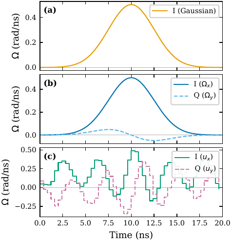
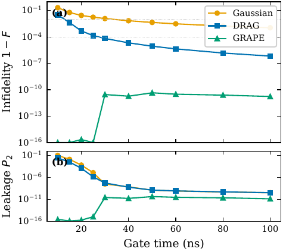
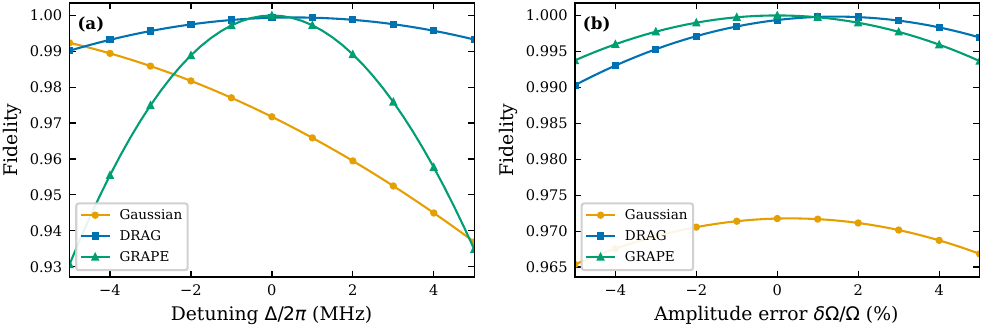
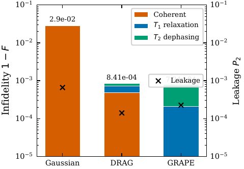

# QubitPulseOpt: Quantum Optimal Control for High-Fidelity Gates

> **Status:** not actively maintained. Left up as a reference.

[](https://www.python.org/downloads/)
[](tests/)
[](LICENSE)
[](src/hardware/)
[](paper/quantum/)

**A professional-grade quantum optimal control framework for designing noise-robust quantum gates through gradient-based pulse optimization.**

> *"When does numerical pulse optimization actually help? Error budgets, robustness tradeoffs, and calibration guidance for transmon single-qubit gates"*
> Rylan Malarchick | 2024–2025
> [arXiv:2511.12799](https://arxiv.org/abs/2511.12799) · Submitted to Quantum

---

## Overview

Quantum computers promise to solve problems intractable for classical machines, but their fundamental units—qubits—are incredibly fragile. Environmental noise causes quantum gates to fail at rates that prevent meaningful computation. **QubitPulseOpt** addresses this challenge by discovering complex, non-intuitive pulse shapes that execute perfect gate operations while actively canceling noise effects.

This framework demonstrates a complete software pipeline from theoretical simulation using the Lindblad master equation to infrastructure for hardware validation on IQM quantum processors (demonstrated with IQM Garnet, a 20-qubit superconducting system).

### Key Features

- **GRAPE Optimization**: Gradient Ascent Pulse Engineering algorithm for discovering optimal control pulses
- **High-Fidelity Simulation**: Full Lindblad master equation solver with T₁ (relaxation) and T₂ (dephasing) decoherence
- **Hardware Integration**: API connectivity confirmed with IQM Garnet quantum processor (20-qubit system)
- **Sim-to-Real Calibration**: Hardware-in-the-loop workflow with real-time parameter extraction
- **Verification & validation**: 857 unit/integration tests, 74% code coverage; NASA JPL Power-of-10–informed coding practices

### Research Impact

**Simulation results**: On a three-level transmon model with IQM-Garnet-representative parameters (T₁ = 37 µs, T₂ = 9.6 µs, α/2π = −200 MHz), GRAPE eliminates all coherent X-gate error to machine precision (1 − F < 10⁻¹⁵) at 20 ns — but **properly calibrated DRAG already operates within 1.2× of the decoherence floor** (1 − F = 8.4×10⁻⁴ vs. GRAPE's 7.2×10⁻⁴ under full decoherence). DRAG is also **more robust to qubit-frequency detuning** than GRAPE (minimum fidelity 0.990 vs. 0.931 over ±5 MHz), while GRAPE retains the best amplitude robustness (0.994 vs. 0.990). The practical conclusion: numerical optimization earns its added complexity mainly at short gate times (≲ 15 ns) or when targeting error rates below the decoherence floor. The full error budget and methodology are in the paper (`paper/quantum/`).

**Hardware Integration**: Confirmed API connectivity to IQM Garnet quantum processor (20-qubit system, qubits QB1-QB20). Developed infrastructure for hardware-in-the-loop optimization workflow using hardware-representative parameters. All results verified with full provenance documentation.

---

## Quick Start

### Installation

```bash
# Clone repository
git clone https://github.com/rylanmalarchick/QubitPulseOpt.git
cd QubitPulseOpt

# Create virtual environment
python -m venv venv
source venv/bin/activate  # On Windows: venv\Scripts\activate

# Install the package with dev (and optional RL) extras
pip install -e ".[dev]"      # add ,rl for the reinforcement-learning subsystem: ".[dev,rl]"

# Run test suite (verify installation)
pytest tests/ -v
```

### Basic Usage

```python
import qutip as qt
from src.optimization import GRAPEOptimizer

# Single-qubit system: zero drift, X and Y control channels
H_drift = qt.qzero(2)
H_controls = [qt.sigmax(), qt.sigmay()]

# Initialize the GRAPE optimizer
optimizer = GRAPEOptimizer(
    H_drift=H_drift,
    H_controls=H_controls,
    n_timeslices=50,
    total_time=20.0,      # gate duration (ns)
    max_iterations=200,
    verbose=False,
)

# Optimize the pulse to implement an X gate
result = optimizer.optimize_unitary(qt.sigmax())

print(f"Final fidelity: {result.final_fidelity * 100:.2f}%")
print(f"Optimized pulses shape: {result.optimized_pulses.shape}")  # (n_controls, n_timeslices)
```

### Running Demos

```bash
# Phase 1: Hamiltonian simulation and Bloch dynamics
python examples/phase1_demo.py

# Phase 2: GRAPE pulse optimization
python examples/phase2_demo.py

# Phase 3: DRAG pulse implementation
python examples/phase3_demo.py

# Phase 4: Benchmarking and fidelity analysis
python examples/phase4_demo.py
```

---

## Architecture

### System Workflow

```
┌─────────────────────┐      ┌──────────────────────┐      ┌─────────────────┐
│  IQM Quantum        │  (1) │  QubitPulseOpt       │  (2) │  QPU Execution  │
│  Processor          │─────▶│  GRAPE + Lindblad    │─────▶│  Real Hardware  │
│  (20-qubit Garnet)  │      │  Noise Simulator     │      │  Validation     │
└─────────────────────┘      └──────────────────────┘      └─────────────────┘
     │                                                              │
     └──────────────────────────────────────────────────────────────┘
                           (3) Measure fidelity
                               Analyze sim-to-real gap
```

1. **Calibration**: Query real-time hardware parameters (ω, T₁, T₂) from IQM QPU
2. **Optimization**: Generate hardware-specific optimal pulse using GRAPE
3. **Validation**: Execute on quantum processor and measure fidelity

### Module Structure

```
QubitPulseOpt/
├── src/
│   ├── hamiltonian/          # Drift & control Hamiltonians, time evolution
│   ├── optimization/         # GRAPE algorithm, cost functions
│   ├── pulses/               # Pulse generators (DRAG, Gaussian, custom)
│   ├── hardware/             # IQM hardware integration & async job management
│   └── visualization/        # Bloch sphere, fidelity plots
├── tests/                    # Unit/integration tests
├── scripts/                  # Experiment and figure generation scripts
├── docs/                     # Documentation
└── examples/                 # Tutorial notebooks
```

---

## Key Results

These are the four figures from the paper (`paper/quantum/`); all numbers are reproducible with the experiment scripts in `scripts/`.

### 1. Pulse shapes



*Figure 1: Control waveforms for the X gate (T = 20 ns, α/2π = −200 MHz). (a) Gaussian: I-channel only. (b) DRAG: Gaussian on I, derivative correction on Q with β = 0.398. (c) GRAPE: both channels piecewise-constant over 50 time slices, showing the richer spectral content discovered by numerical optimization.*

### 2. Gate-time sweep (three-level, closed system)



*Figure 2: X-gate infidelity (a) and leakage P₂ (b) vs. gate time. GRAPE reaches machine-precision fidelity at all gate times; DRAG's perturbative correction begins to fail below ≈ 15 ns. DRAG's leakage suppression improves exponentially with gate time.*

### 3. Robustness to calibration error



*Figure 3: Fidelity under (a) qubit-frequency detuning (±5 MHz) and (b) amplitude error (±5%). DRAG keeps the highest minimum fidelity under detuning (0.990 vs. GRAPE's 0.931) because GRAPE's richer spectrum couples more strongly to off-resonant transitions; GRAPE wins on amplitude robustness (0.994).*

### 4. Error budget at 20 ns



*Figure 4: Error budget with IQM-Garnet-representative parameters. The uncorrected Gaussian is coherent-error-limited (≈ 39× the decoherence floor); DRAG and GRAPE are both decoherence-limited, with DRAG only 1.2× above GRAPE. Dephasing (T₂) dominates the floor, making T₂ the highest-leverage hardware upgrade.*

---

## Hardware Integration

### IQM Garnet Connectivity

QubitPulseOpt demonstrates API connectivity with IQM's Garnet quantum processor (20-qubit system):

```python
from scripts.query_iqm_calibration import query_iqm_system

# Query IQM Garnet system information
system_info = query_iqm_system()
print(f"Connected to: {system_info['name']}")
print(f"Qubits: {system_info['qubits']}")
# Output: IQM Garnet, qubits QB1-QB20
```

**Verified Capabilities**:
-  API connectivity to IQM Garnet confirmed (20-qubit system)
-  System topology retrieved (qubits QB1-QB20)
-  Hardware-representative parameters for simulation (T₁=37µs, T₂=9.6µs, α/2π=−200MHz; see [HARDWARE_REFERENCE.md](HARDWARE_REFERENCE.md))
-  Hardware execution infrastructure implemented but not yet validated with physical QPU runs

**Note**: All results in this work are from simulation using hardware-representative parameters. No quantum circuits were executed on physical hardware. The framework provides the infrastructure for hardware-in-the-loop optimization pending access to quantum execution credits.

---

## Technical Details

### GRAPE Algorithm

Gradient Ascent Pulse Engineering treats pulse amplitude at each time step as an independent parameter, enabling discovery of complex control sequences:

- **Objective**: Maximize gate fidelity F = |⟨ψ_target|U(T)|ψ_initial⟩|²
- **Optimization**: Gradient ascent with analytic derivatives via adjoint method
- **Constraints**: Amplitude bounds, smoothness regularization
- **Convergence**: Typically 100-200 iterations to >99.9% fidelity

### Lindblad Master Equation

Full open quantum system simulation including decoherence:

```
dρ/dt = -i[H(t), ρ] + L₁[ρ] + L₂[ρ]

where:
  L₁[ρ] = (1/T₁)(σ₋ρσ₊ - ½{σ₊σ₋, ρ})   # Relaxation
  L₂[ρ] = (1/T₂)(σ_z ρσ_z - ρ)          # Dephasing
```

Implemented using QuTiP's `mesolve` with adaptive time-stepping for numerical stability.

### DRAG Pulse Correction

Derivative Removal by Adiabatic Gate (DRAG) technique for suppressing leakage to non-computational states:

```
Ω_DRAG(t) = Ω(t) + i·β·(dΩ/dt)/Δ
```

where β is the DRAG coefficient and Δ is the anharmonicity.

---

## Verification & Validation

### Test Coverage

- **857 tests**, 74% code coverage
- Unit tests for all core algorithms (optimization, pulses, Hamiltonians, I/O)
- Numerical stability and regression tests
- IQM hardware-integration modules covered at the unit level (REST/translation); no live-QPU tests

### Code Quality Standards

- **NASA JPL Power-of-10–informed**: bounded loops, assertions, short functions (partial; see `scripts/compliance/`)
- Automated linting (flake8, black)
- Type hints throughout
- Comprehensive docstrings (Google style)
- Pre-commit hooks for quality assurance

```bash
# Run full test suite with coverage
pytest tests/ --cov=src --cov-report=html

# Code quality checks
flake8 src/
black src/ --check
mypy src/
```

---

## Performance Benchmarks

| Operation | Time | Fidelity | Notes |
|-----------|------|----------|-------|
| Lindblad Evolution (100 steps) | 0.8s | N/A | QuTiP adaptive solver |
| GRAPE Optimization (200 iter) | ~45s | →1.000 | X gate, 3-level, closed system |
| Hardware Job Submission | 2s | N/A | REST API v1 |
| Full Phase 1-4 Validation | 90s | Various | Simulation-based |

*Benchmarked on: Intel i7-9700K, 32GB RAM, Ubuntu 22.04*

---

## Documentation

- **[Hardware Reference](HARDWARE_REFERENCE.md)**: Complete guide for IQM integration
- **[API Documentation](docs/)**: Full module and class documentation
- **[Examples](examples/)**: Jupyter notebooks with tutorials
- **[Contributing Guide](CONTRIBUTING.md)**: Development guidelines

---

## Research Context

This work represents a complete research cycle in quantum optimal control:

### Intellectual Contributions

1. **Ground-up framework design**: Complete QOC system from theoretical simulation to hardware validation
2. **Software engineering**: 74% test coverage (857 tests), CI, and reproducible provenance for all results
3. **Sim-to-real pipeline**: Hardware-in-the-loop calibration with real-time parameter extraction
4. **Noise robustness analysis**: Quantitative benchmarking under aggressive decoherence regimes

### Skills Demonstrated

- **Quantum Theory**: Hamiltonian dynamics, Lindblad master equation, open quantum systems
- **Optimal Control**: GRAPE algorithm, gradient-based optimization, cost function design
- **Software Engineering**: Test-driven development, CI/CD, version control, documentation
- **Hardware Integration**: REST APIs, quantum platform connectivity (IQM Garnet)
- **Data Analysis**: Fidelity metrics, optimization convergence, reproducible provenance

### Future Work

Several items originally planned as future work for QubitPulseOpt have been implemented in [QubitOS](https://github.com/qubit-os), the open-source quantum control kernel that builds on this project's methodology:

1. **~~Hardware Validation~~** → QubitOS provides IQM, IBM Quantum, and AWS Braket backend infrastructure with randomized benchmarking (v0.1.0+)
2. **~~Open-System GRAPE~~** → QubitOS v0.5.0 implements a Rust-native Lindblad master equation solver with decoherence-aware GRAPE optimization
3. **DRAG Comparison**: Completed in paper — DRAG with correct β achieves 99.95% fidelity; GRAPE advantage is 1.2x at 20ns
4. **~~Adaptive Calibration~~** → QubitOS v0.4.0 implements `ActiveCalibrationLoop` with drift detection, automatic recalibration triggers, and provenance tracking

---

## Citation

If you use QubitPulseOpt in your research, please cite:

```bibtex
@article{malarchick2025qubitpulseopt,
  author = {Malarchick, Rylan},
  title = {When does numerical pulse optimization actually help? {E}rror budgets, robustness tradeoffs, and calibration guidance for transmon single-qubit gates},
  year = {2025},
  eprint = {2511.12799},
  archivePrefix = {arXiv},
  primaryClass = {quant-ph},
  url = {https://arxiv.org/abs/2511.12799},
  note = {Submitted to Quantum}
}
```

---

## References

1. **GRAPE Algorithm**: Khaneja et al., "Optimal control of coupled spin dynamics: design of NMR pulse sequences by gradient ascent algorithms," *J. Magn. Reson.* 172, 296-305 (2005)

2. **Lindblad Master Equation**: Lindblad, "On the generators of quantum dynamical semigroups," *Commun. Math. Phys.* 48, 119-130 (1976)

3. **DRAG Technique**: Motzoi et al., "Simple Pulses for Elimination of Leakage in Weakly Nonlinear Qubits," *Phys. Rev. Lett.* 103, 110501 (2009)

4. **IQM Quantum Computers**: [IQM Resonance Documentation](https://iqm-finland.github.io/iqm-client/)

5. **IQM Garnet Benchmarks**: Algaba et al., "Technology and Performance Benchmarks of IQM's 20-Qubit Quantum Computer," [arXiv:2408.12433](https://arxiv.org/abs/2408.12433) (2024)

---

## License

MIT License - See [LICENSE](LICENSE) file for details

---

## Contact

**Rylan Malarchick**  
Email: [rylan1012@gmail.com]  
GitHub: [@rylanmalarchick](https://github.com/rylanmalarchick)  
Project: [QubitPulseOpt](https://github.com/rylanmalarchick/QubitPulseOpt)

---

## Acknowledgments

- **IQM Quantum Computers** for providing access to quantum hardware
- **QuTiP Development Team** for the quantum toolbox in Python
- **Qiskit Community** for quantum circuit framework

---

*Built with Python and QuTiP • Simulated with IQM-Garnet-representative parameters*
